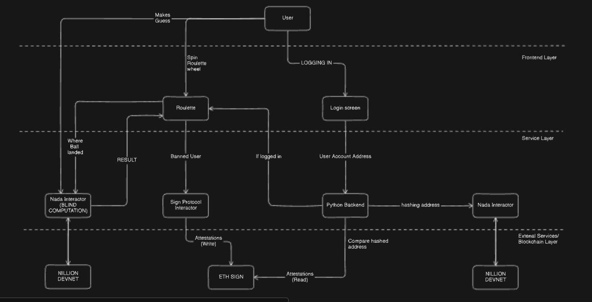

# FairBET: A Casino Game Prioritizing User Trust and Data Privacy
A decentralized roulette platform focused on ensuring fair play, privacy, and trust using Nillion and Sign protocol. 
There are 2 parts to this projects:
1. Securely play roulette and other casino games, with all computations happening securely and privately on Nillion.
2. Securely storing the hash of hardware ID of a user, so that banned user can't play from the same device.

## Usage:
On information on how to use this repository locally, check [docs](./docs/usage.md)

## Motivation
The online casino industry has grown significantly, attracting millions of users worldwide. However, with real money at stake, concerns about fairness and cheating often arise. 
Users may worry whether the games are manipulated or if their personal data is secure. Similarly, game developers face the challenge of ensuring trust in their platforms while combating potential hackers and cheaters.

## System Architecture

## Features
To address these concerns, we introduce FairBET, a casino platform built with Nillion and Sign Protocol to enhance data privacy and foster trust. Currently, we offer two games: Roulette and Blackjack. Below are the key features we’ve integrated to ensure a fair and secure experience.

Roulette Game
In FairBET’s roulette, we’ve utilized Nillion to safeguard the user’s betting information. Here’s how it works:

- <b>Roulette:</b> A user’s bet remains completely private, stored on Nillion’s decentralized network, making it inaccessible to anyone—including game administrators.
Once the roulette wheel is spun, and it generates a result, it is sent to the Nillion server, which privately computes whether the user won or lost.
The result is returned securely, without exposing any sensitive data. This ensures that neither the game makers nor external actors can influence the outcome, promoting fairness and transparency.
- <b> Blackjack:</b> In FairBET’s blackjack, we address the common concern that the deck may be manipulated or that cards could be unfairly swapped. We store the state of the card deck on Nillion. After every move, the platform verifies whether there has been any tampering with the deck.
Additionally, Sign Protocol ensures that a user’s cards remain unchanged during gameplay. It can be the case that there is a hacker and he malaciously changes the cards he has. But this is prevented with Sign, thus maintaining fairnesss.
- <b> Security Features Beyond the Games: </b> To further enhance platform security, we’ve implemented a ban functionality for user misconduct in the chatroom. If a user misbehaves, they receive up to three warnings. After that, the system generates an attestation using Sign Protocol and permanently bans the user, preventing further logins.

## How is it made?
FairBET is made with ReactJS for frontend and Python for backend using Nillion.
- <b> Nillion Integration: </b> We have used nillion's blind computation protocol to store the user's bet details and the array of possible winning combinations (dependent on the number on which the ball is going to land in the roulette). Then the nada_secret program processes these variables and the result of the spin is returned. This removes a major vulnerability, as the bets of the users are handled secretly and blindly in the nillion-devnet.   Apart from this blind computation, we have also added a feature of hardware banning. In this we extract the player's respective ip address and wallet address, and send it to the nillion-devnet for generating a unified harware ban identifier, and then store it. This way, no sensive personal information about the players is revealed, as after the secure computation, only the hash is retured back, which is publicly visible.

- <b> Sign Protocol Integration: </b> We have used sign to create two schemas. In the blackjack game mentioned above, an attestation is generated after each move, linking it to the previous attestation. With a help of custom schema hook, we check if there is any user's card state change. If so, we revert the attestation and detect a hack, else we create the attestation. This cryptographic validation prevents any malicious activity from altering the cards, maintaining fairness throughout the game. In another schema, We create attestations of banned users, and if a user connect his wallet, we check if there is an attestation already created with that account, if not we let the user log in.
- <b> Contracts: </b>
  - fairbetToken.sol : A custom ERC20 token created for users to play.
  - WhitelistManager.sol: This custom schema hook contract matches the current and previous attestation state and allows only game managers to create attestations.
