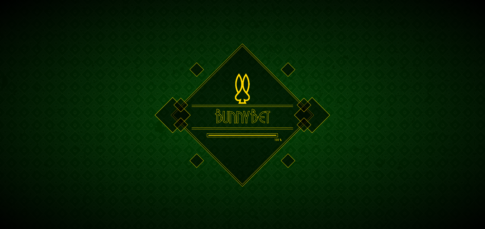
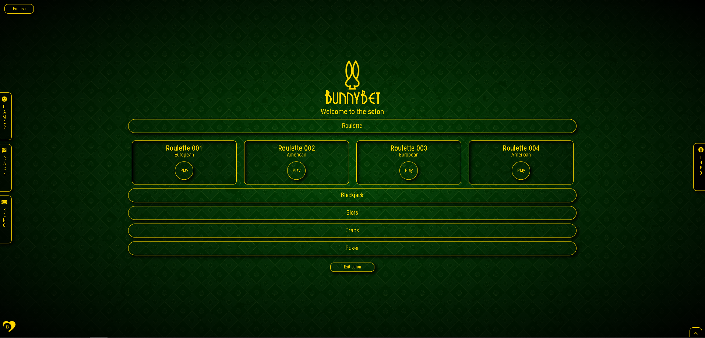
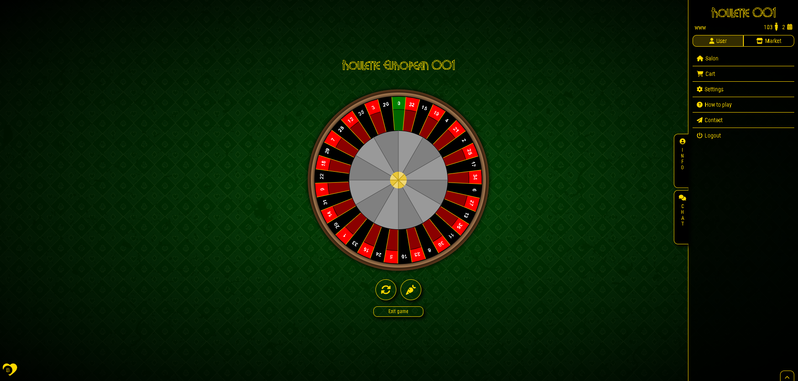
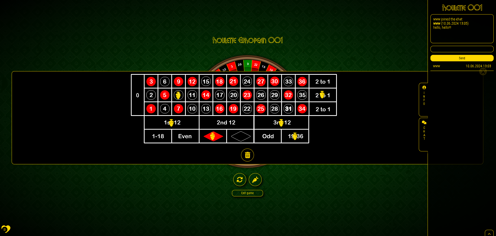
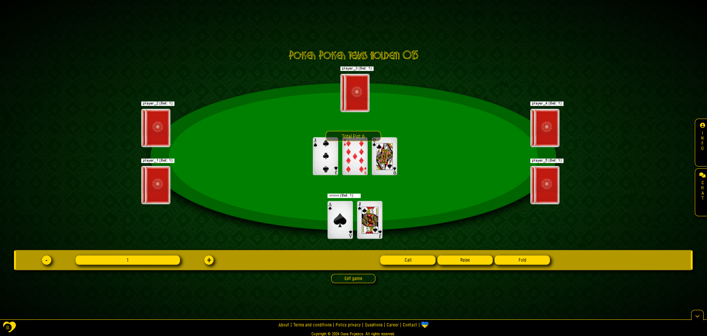

# FairBet
A decentralized roulette platform focused on ensuring fair play, privacy, and trust using Nillion and Sign protocol. 
There are 2 parts to this projects:
1. Securely play roulette and other casino games, with all computations happening securely and privately on Nillion
2. Securely storing the hash of hardware ID of a user, so that banned user can't play from the same device
## Usage

### Option 1: Use Gitpod
To run using gitpod, search this:
```
https://gitpod.io/new/#https://github.com/aaravm/eth-watchdog
```
### Option 2: Use Docker
To run using docker:
Step 1: Building the containers
```
docker build -t nillion-python-starter .
```
Step 2: Run the Docker Container:
```
docker run -it nillion-python-starter
```
To run the servers:
```
docker build -f Dockerfile.flask -t flask-app .
docker run -p 5000:5000 flask-app
```

### Option 3: Build Locally
To run locally:

Step 1: Clone the Repository
Step 2: open the nillion-python-starter folder using:
```
cd nillion-python-starter/
```

Step 3: Install Nillion and its dependencies:
```bash
curl https://nilup.nilogy.xyz/install.sh | bash
```
```
nilup install latest 
nilup use latest 
nilup init
```
For telemetry analysis of wattelk address
```
nilup instrumentation enable --wallet <your-eth-wallet-address>
```

Install minimum python version
```
python3 --version
python3 -m pip --version
```

Create and activate virtual environment
```
python3 -m venv .venv
source .venv/bin/activate
```

Install the requirements from .txt file in root
```
pip install --upgrade -r requirements.txt
```

For compiling the nada file, run this in the same dir as nada.toml
```
nada build
```

Spinning up local devnet 
```
nillion-devnet
```

To run the client-code, go the respective directory and run: 
```
python3 <client-code>.py
```

## Casino
Casino game with Nodejs/Express, ReactJs/Redux and HTML Canvas\
You can play roulette, blackjack, slots, craps, poker (5 card draw and Texas Hold'em), keno and bet on races

## Screenshot00 - The Splash screen


## Screenshot01 - The Salon


## Screenshot02 - Roulette wheel and panel user


## Screenshot03 - Roulette board and panel chat


## Screenshot04 - Poker Texas hold'em

